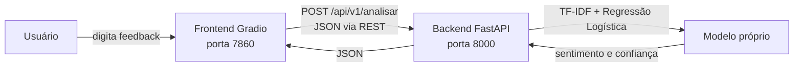

# Feedback Inteligente

Projeto da disciplina de Serviços de Software: uma aplicação que analisa feedbacks de clientes.

## Funcionalidades

- classificação do sentimento em **positivo**, **neutro** ou **negativo**;
- nível de confiança e probabilidades de cada classe;
- prioridade de atendimento (**baixa**, **média** ou **alta**);
- extração de palavras-chave;
- recomendação de próxima ação para a equipe de atendimento;
- documentação interativa da API com Swagger.

## Arquitetura



O projeto possui exatamente dois containers:

| Serviço | Tecnologia | Responsabilidade |
|---|---|---|
| `frontend` | Gradio | Interface com o usuário e consumo da API REST |
| `backend` | FastAPI + scikit-learn | Validação, inferência do modelo e composição da resposta |

O modelo é treinado na inicialização do backend com `backend/data/feedbacks.csv`. A representação de texto utiliza TF-IDF com unigramas e bigramas; a classificação utiliza Regressão Logística balanceada.

## Como executar

Pré-requisito: Docker Desktop ou Docker Engine com Docker Compose.

```bash
git clone URL_DO_SEU_FORK
cd servicos-software-2026-1
docker compose up --build
```

Depois, acesse:

- aplicação: http://localhost:7860
- documentação da API: http://localhost:8000/docs
- health check: http://localhost:8000/health

Para encerrar:

```bash
docker compose down
```

## Exemplo de uso da API

```bash
curl -X POST http://localhost:8000/api/v1/analisar \
  -H "Content-Type: application/json" \
  -d '{"texto":"O produto veio com defeito e preciso de reembolso urgente."}'
```

## Testes

```bash
pip install -r backend/requirements.txt -r tests/requirements.txt
pytest -q
```

Após iniciar os containers:

```bash
curl --fail http://localhost:8000/health
curl --fail http://localhost:7860
```

## Estrutura

```text
.
├── backend/
│   ├── app/
│   │   ├── main.py
│   │   └── model.py
│   ├── data/feedbacks.csv
│   ├── Dockerfile
│   └── requirements.txt
├── frontend/
│   ├── app.py
│   ├── Dockerfile
│   └── requirements.txt
├── tests/test_api.py
├── compose.yaml
└── README.md
```

## Texto sugerido para o campo “Entrada de texto”

> A aplicação Feedback Inteligente permite que o usuário insira um comentário de cliente em português. O frontend, desenvolvido com Gradio, envia o texto por meio de uma requisição POST para a API REST do backend, desenvolvida com FastAPI. O backend utiliza um modelo próprio de processamento de linguagem natural, baseado em TF-IDF e Regressão Logística, para classificar o sentimento como positivo, neutro ou negativo. A resposta também apresenta o nível de confiança, as probabilidades das classes, palavras-chave, a prioridade de atendimento e uma ação recomendada. A solução é executada em dois containers Docker orquestrados pelo Docker Compose.

## Limitações e possíveis evoluções

O conjunto de treinamento é pequeno e foi criado para fins acadêmicos, portanto o modelo é uma prova de conceito. Como evolução, seria possível ampliar e versionar a base, medir precisão, recall e F1 em um conjunto de teste e registrar os feedbacks em banco de dados.

